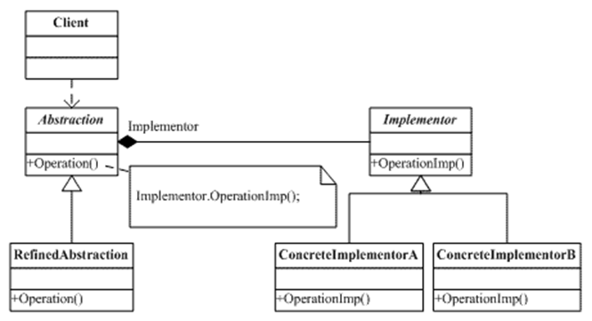

#### 填空题

- SOLID原则：五个空
- 列举五种代理模式：五个空

#### 选择题

1. 女娲根据自己的形状捏人，是什么模式：原型模式
2. 一系列产品，什么模式：抽象工厂
3. 多态反映了什么：a.开闭原则  b.xxx  c.组合模式  d.接口隔离原则
4. 忘了
5. 以下结构图是什么模式：桥接模式

#### 简答题

1. 简述依赖倒转原则
2. 为什么倾向于使用组合（聚合）而不是继承
3. 比较迭代器模式和访问者模式
4. 类适配器模式和对象适配器模式的优缺点
5. 比较模板模式和策略模式（这题10分，其余5分）

#### 分析题

1. 你认为 工作流引擎 运用了什么设计模式？（15分）
2. 一个公司要自己设计一个map，在元素个数少于一千时，使用二叉树实现，在一千到一万时，使用红黑树实现，在大于一万时，使用哈希实现，需要考虑什么问题？使用什么设计模式解决？（20分）

